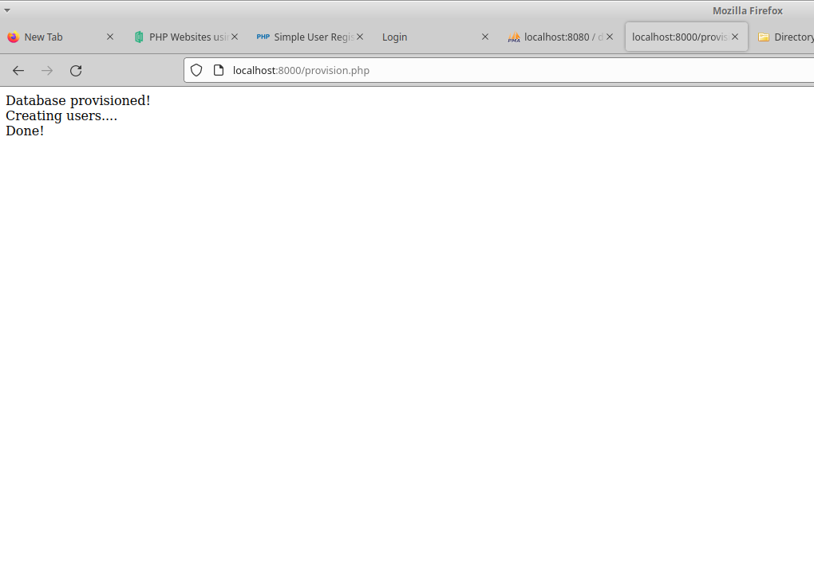
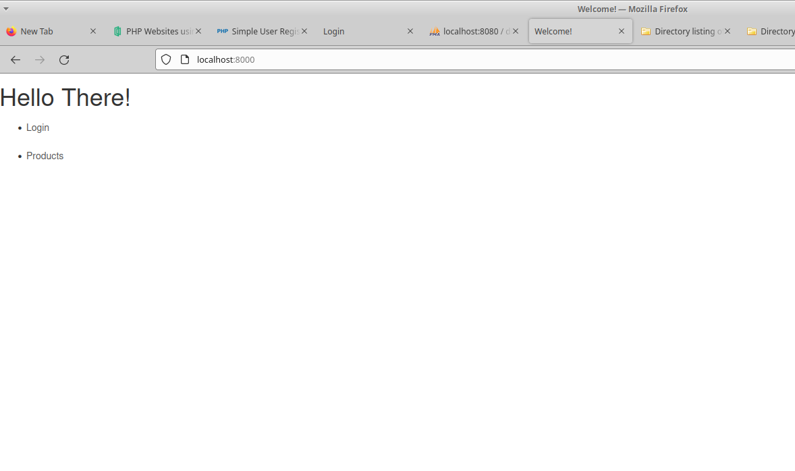
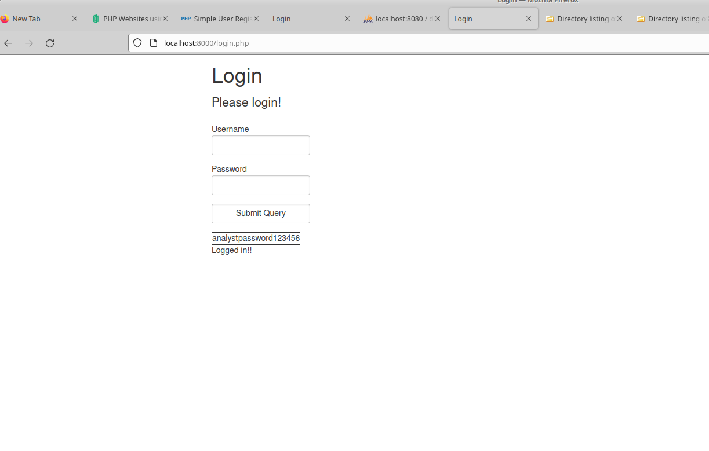
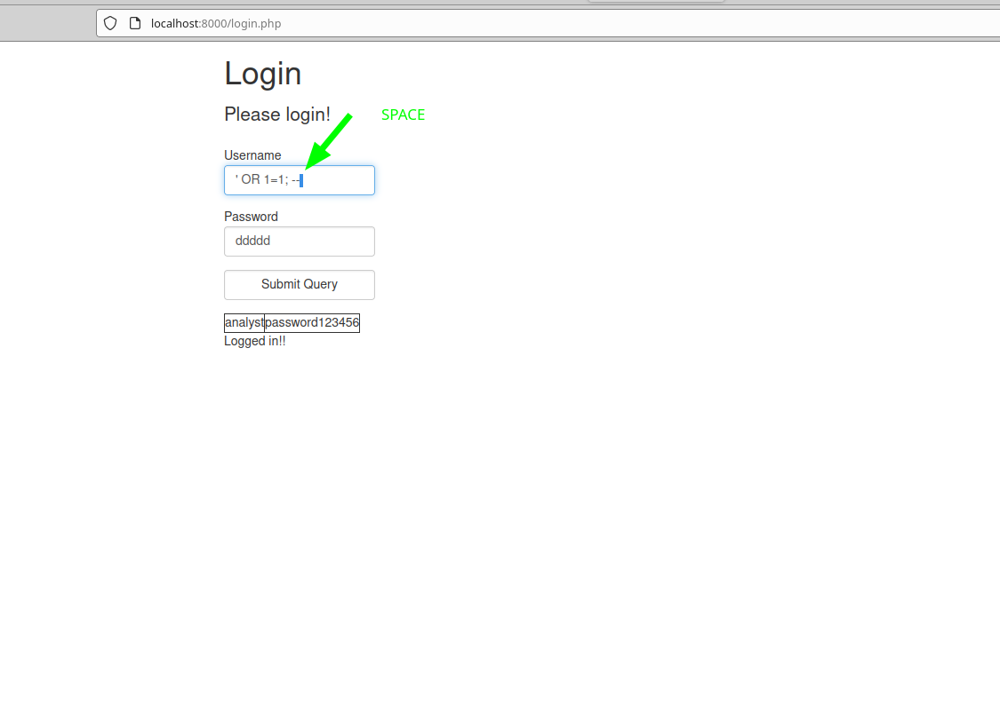
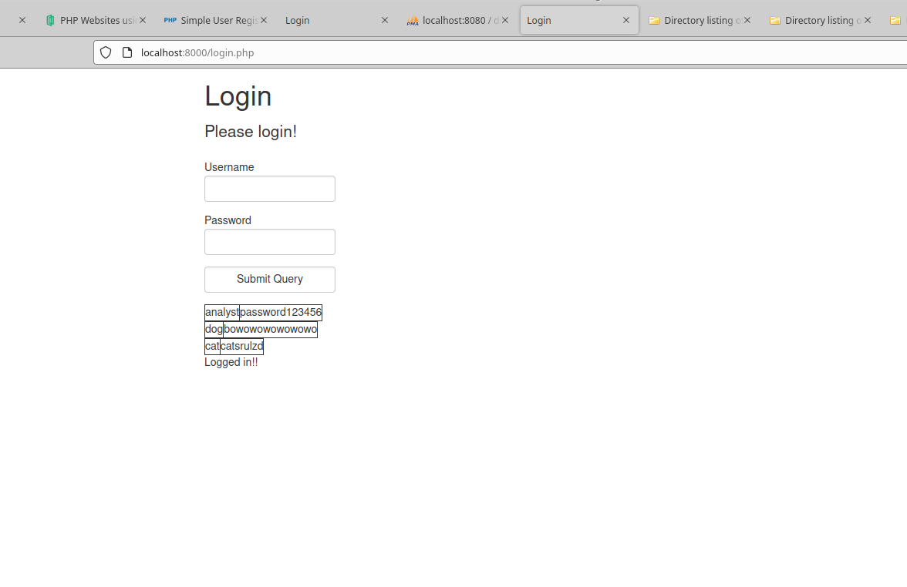
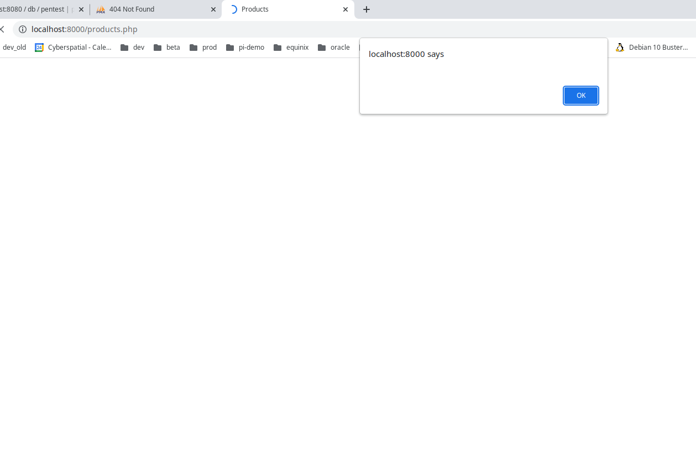

# Pentest Playgound

- [Pentest Playgound](#pentest-playgound)
  - [Installation](#installation)
    - [Install Docker & Docker Compose](#install-docker--docker-compose)
    - [Run the stack locally using Docker](#run-the-stack-locally-using-docker)
  - [Create an application database](#create-an-application-database)
    - [Checkout out the vulnerable website:](#checkout-out-the-vulnerable-website)
  - [Attacks](#attacks)
    - [Login.php -- an SQL Injection](#loginphp----an-sql-injection)
    - [XSS](#xss)
  - [Deploying on a server (cloud)](#deploying-on-a-server-cloud)
    - [Virtual Machine](#virtual-machine)
  - [Hardening the Stack Before Production (optional)](#hardening-the-stack-before-production-optional)
  - [References](#references)

## Installation

### Install Docker & Docker Compose

   * Windows
      * [Docker Desktop](https://docs.docker.com/desktop/install/windows-install/)
      * Note: `docker-compose` is installed as part of Docker Desktop

   * Linux:
      * [Installing Docker](https://www.digitalocean.com/community/tutorials/how-to-install-and-use-docker-on-ubuntu-22-04)
      * [Installing docker-compose](https://www.digitalocean.com/community/tutorials/how-to-install-and-use-docker-compose-on-ubuntu-22-04)

### Run the stack locally using Docker

From the top directory of this repo:

```
docker-compose up
```

It should show something like:


```
[+] Running 3/3
 ⠿ Container db                               Created                                                                                                                                                                                   0.1s
 ⠿ Container pentest-playground-phpmyadmin-1  Created                                                                                                                                                                                   0.1s
 ⠿ Container php-apache                       Created                                                                                                                                                                                   0.1s
Attaching to db, pentest-playground-phpmyadmin-1, php-apache
db                               | 2022-10-30 08:32:32+00:00 [Note] [Entrypoint]: Entrypoint script for MySQL Server 8.0.31-1.el8 started.
db                               | 2022-10-30 08:32:32+00:00 [Note] [Entrypoint]: Switching to dedicated user 'mysql'
db                               | 2022-10-30 08:32:32+00:00 [Note] [Entrypoint]: Entrypoint script for MySQL Server 8.0.31-1.el8 started.
db                               | 2022-10-30 08:32:32+00:00 [Note] [Entrypoint]: Initializing database files
db                               | 2022-10-30T08:32:32.828363Z 0 [Warning] [MY-011068] [Server] The syntax '--skip-host-cache' is .
.
.

db                               | 2022-10-30T08:32:49.667078Z 0 [System] [MY-013602] [Server] Channel mysql_main configured to support TLS. Encrypted connections are now supported for this channel.
db                               | 2022-10-30T08:32:49.671639Z 0 [Warning] [MY-011810] [Server] Insecure configuration for --pid-file: Location '/var/run/mysqld' in the path is accessible to all OS users. Consider choosing a different directory.
db                               | 2022-10-30T08:32:49.709621Z 0 [System] [MY-011323] [Server] X Plugin ready for connections. Bind-address: '::' port: 33060, socket: /var/run/mysqld/mysqlx.sock
db                               | 2022-10-30T08:32:49.709657Z 0 [System] [MY-010931] [Server] /usr/sbin/mysqld: ready for connections. Version: '8.0.31'  socket: '/var/run/mysqld/mysqld.sock'  port: 3306  MySQL Community Server - GPL.
```

Note:  docker-compose is running in the foreground, so keep this window open.  Run the remaining commands from a new window.

## Create an application database

The stack deploys with mysql which actually has multiple databases.

This include an application database defined by the `MYSQL_DATABASE` (defaults to `pentest`) variable in the [docker-compose file](./docker-compose.yaml).

You need to provision this database so it has the table and application users.

You can to this by visiting the following helper script:

[http://localhost:8000/provision.php](http://localhost:8000/provision.php)

It should respond with:

```
Database provisioned!
Creating users....
Done!
```



This ensures the database we specified in the `MYSQL_DATABASE` field of [docker-compose.yaml](./docker-compose.yaml) is created and has some sample data.

### Checkout out the vulnerable website:

You can now try the vulnerable apps.

Navigate to:  [http://locahost:8000](http://locahost:8000)




## Attacks

### Login.php -- an SQL Injection

The login.php page features a simple login form backed by the appusers table of tge pentest database:

When you login using the  `MYSQL_USER` and  `MYSQL_PASSWORD` variables set in the [docker-compose.yaml](./docker-compose.yaml)
A successful login shows the username and password and a success message.



The login page is backed by a script that checks if the logged in user is in the pentest mysql database provisioned early.  The username and password fields of the form are both injectable.

Navigate to:  http://localhost:8000/login.php


Insert the following as the Username

```
' OR 1=1; --[space]  
```

Note space is a whitespace after the `--`

Enter any password.  




This will then reveal the other users in the system.



### XSS

The "products" pages is xss injectable and inspired from [moeinfatehi xss_vulnerability_challenge #5](https://github.com/moeinfatehi/xss_vulnerability_challenges/tree/master/src/xss5).  


Navigate to:  http://localhost:8000/products.php

And, enter the following:

```
"><script>alert(document.cookie)</script>
```

This should respond with an alert message:




## Deploying on a server (cloud)

### Virtual Machine

1.  Install docker on the virtual machine
2.  Put this repo on the machine 
3.  When you run docker, start it in the background:

```
docker-compose up -d
```

This will run the applicatoin in the background.


## Hardening the Stack Before Production (optional)

*  Before placing this on the internet, It is recommended that you change the default usernames and passwords

Shutdown/CTRL-C docker compose

Edit the [docker-compose.yaml](./docker-compose.yaml) file and change the following:

```.
MYSQL_ROOT_PASSWORD: mysqlpentestroot
MYSQL_USER: analyst
MYSQL_PASSWORD: password123456
```

Also edit the following:

  * [login page php script](./php/src/login.php) 
  * [provisioning script](./php/src/provision.php)
  
  ..and ensure the MYSQL variables match for root_password, mysql_database, etc.


Docker caches its images locally, so you will need to force a refresh of the cocker-compose process so it buildes with the new changes to docker-compose.yaml:

```
docker-compose rm -f
docker-compose pull
docker-compose up --force-recreate
```

Revistit the privisioning script:  [http://localhost.com/provision.php](http://localhost.com/provision.php)

## References

   * [Awesome tutorial from Joseph Chege](https://www.section.io/engineering-education/)dockerized-php-apache-and-mysql-container-development-environment/
   * [xss_vulnerability_challenges](https://github.com/moeinfatehi/xss_vulnerability_challenges/tree/master/src)